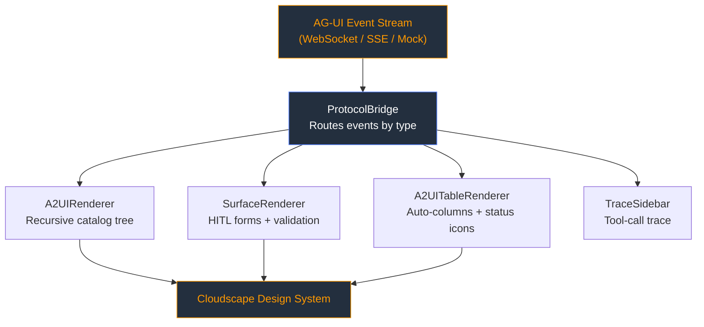

In the rapidly evolving landscape of AI agents, one of the most significant challenges is **Human-in-the-Loop (HITL)** interaction. When an agent needs to present a complex table of data, request a multi-step form approval, or show a dashboard, how does it communicate that to the frontend?

Standardizing this interaction is the goal of the **Agent-to-UI (A2UI)** protocol. In this post, I’ll walk through [agui-cloudscape-renderer](https://github.com/golevishal/agui-cloudscape-renderer), a project I built to bridge this protocol with the AWS Cloudscape Design System.

## The Problem: Backend Agents vs. Frontend Bloat

Normally, if an agent needs a specific UI, developers build a custom React component, define a proprietary JSON schema, and hard-code the integration. This doesn't scale. As agents become more autonomous, they need a way to "render" their own interfaces dynamically.

The **A2UI Protocol** solves this by defining a standardized catalog of UI components that an agent can request. The frontend then becomes a "dumb" renderer that knows how to turn those protocol events into functional interfaces.

## Architecture: The Bridge Pattern

The library acts as the presentation layer for the A2UI protocol. It maps the protocol's primitive components (Cards, Tables, Buttons) 1:1 to **AWS Cloudscape** components.



### 1. Protocol-Driven Architecture
The heart of the renderer is a recursive parser. When a backend sends an `A2UI_RENDER` event, the renderer decomposes the JSON and routes it through a `ProtocolBridge`.


```json
{
  "type": "A2UI_RENDER",
  "surface": "main",
  "component": "Card",
  "properties": {
    "header": "Agent Status",
    "children": [
      { "component": "Text", "properties": { "value": "Processing..." } }
    ]
  }
}
```

### 2. Reactive Data Binding
One of the most powerful features of the renderer is its support for reactive paths. By using the `$/path/to/value` syntax, the UI can bind directly to a data model. When the agent sends a `DATA_MODEL_UPDATE`, the renderer updates the specific field without a full re-render of the component tree.

### 3. Human-In-The-Loop (HITL)
For AI agents to be useful in the enterprise, they need approvals. The `SurfaceRenderer` handles bidirectional communication. It manages complex forms, validates inputs via regex, and emits `USER_RESPONSE` events back to the agent once the human interacts.

## Security First: Shoulder-Surfing Protection

Dealing with AI often means dealing with sensitive tokens or configurations. I included a specialized component, `A2UIPropertyRedact`, which provides a click-to-reveal interface. This ensures that sensitive information isn't visible on the screen by default, protecting users from "shoulder surfing" in open environments.

## Conclusion

By decoupling the UI from the agent's core logic, we enable a future where agents can operate across any platform that implements the A2UI protocol. Using Cloudscape ensures that these interfaces aren't just dynamic—they are also accessible, responsive, and enterprise-ready.

Check out the full source code and documentation on GitHub:
👉 [golevishal/agui-cloudscape-renderer](https://github.com/golevishal/agui-cloudscape-renderer)

---
*Stay tuned for more updates as I continue to explore the intersection of AI protocols and design systems!*
