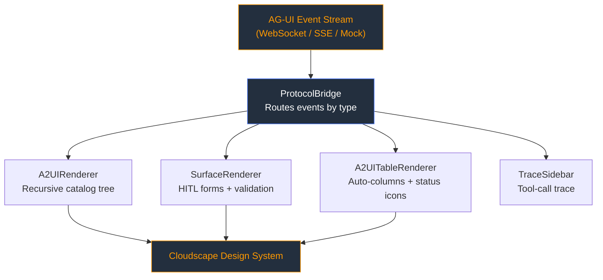

AI agents are quickly moving beyond chat. They need to ask for approvals, show tables, collect structured inputs, expose tool traces, and update state while a task is still running. That creates a practical frontend problem: when an agent needs to present a real interface, how does it describe that UI without every application inventing its own one-off React components and JSON schema?

That is the space I wanted to explore with [agui-cloudscape-renderer](https://github.com/golevishal/agui-cloudscape-renderer): a renderer that takes **Agent-to-UI (A2UI)** style events from an AG-UI stream and turns them into native [AWS Cloudscape](https://cloudscape.design/) components. The goal is simple: let the agent describe *what* interface it needs, while the frontend owns *how* that interface is rendered, validated, and sent back to the agent.

## The Problem: Backend Agents vs. Frontend Bloat

Normally, if an agent needs a specific UI, developers build a custom React component, define a proprietary JSON schema, and hard-code the integration. This doesn't scale. As agents become more autonomous, they need a way to "render" their own interfaces dynamically.

The A2UI approach solves this by defining a catalog of UI primitives that an agent can request: cards, text, buttons, inputs, tables, tabs, modals, and other building blocks. The frontend becomes a protocol renderer. It does not need to know every workflow in advance; it only needs to know how to map valid protocol components into real UI.

That distinction matters. The agent should not ship arbitrary HTML or unsafe frontend code. It should emit structured events. The renderer should interpret those events against a known component catalog, enforce validation, and emit structured user responses back to the agent.

## Why Cloudscape?

For this project, I wanted the output to feel enterprise-ready rather than like a prototype widget kit. Cloudscape is a good fit because it already provides production-grade patterns for forms, tables, status indicators, layout, accessibility, and dense operational interfaces. Those are exactly the surfaces agents tend to need when they move from chat demos into real workflows.

The renderer maps A2UI primitives to Cloudscape components so an agent can request a generic `Table`, `Card`, `TextField`, or `Button`, and the user still gets a consistent Cloudscape experience.

## Architecture: The Bridge Pattern

The library acts as the presentation layer between the agent event stream and the Cloudscape design system. At the center is a `ProtocolBridge` that routes incoming events by type.



The bridge handles render events, human-in-the-loop action requests, state deltas, tool-call traces, and data model updates. Specialized renderers then take over:

- `A2UIRenderer` recursively renders catalog components.
- `SurfaceRenderer` manages HITL forms, validation, and response emission.
- `A2UITableRenderer` generates columns and maps status-like values to Cloudscape status indicators.
- `TraceSidebar` keeps tool activity visible while the main surface updates.

## From Agent Event to UI

The core interaction starts with an `A2UI_RENDER` event. A backend can send a component tree like this:

```json
{
  "type": "A2UI_RENDER",
  "payload": {
    "surface": "main",
    "rootId": "statusCard",
    "components": {
      "statusCard": { "component": "Card", "child": "col" },
      "col": { "component": "Column", "children": ["heading", "status"] },
      "heading": {
        "component": "Text",
        "variant": "h2",
        "text": "Deployment Status"
      },
      "status": {
        "component": "Text",
        "text": "$/deployment/message"
      }
    }
  }
}
```

The renderer resolves the `rootId`, walks the component dictionary, and renders a native Cloudscape card. The `$/deployment/message` value is a reactive binding path. When a later `DATA_MODEL_UPDATE` event arrives, the visible text can update from the data model without rebuilding the whole component tree.

That gives the agent a clean contract: describe the interface as structured data, send state changes as structured data, and let the renderer handle the UI mechanics.


## Human-In-The-Loop Interaction

Human approval is where this pattern becomes especially useful. Agents often need a person to confirm a deployment, approve a generated plan, fill a missing field, or choose between several options. The renderer handles those moments through `ACTION_REQUIRED` style events.

The `SurfaceRenderer` turns an action request into a form, applies field-level validation such as required fields, regex rules, and min/max lengths, then emits a `USER_RESPONSE` event when the user submits. The backend receives a structured response instead of scraping UI state or relying on custom callbacks per workflow.

## Tables, Status, and Multi-Surface UI

The renderer also supports patterns that show up constantly in operational tools:

- tables with generated columns, sorting, and pagination;
- status strings like `Success` or `Failed` rendered as Cloudscape status indicators;
- multiple target surfaces such as `main`, `tools`, and `navigation`;
- a protocol playground for editing JSON payloads and immediately seeing the rendered result.

The current catalog includes layout components such as `Row`, `Column`, `List`, `Card`, `Tabs`, and `Modal`; primitives such as `Text`, `Image`, `Icon`, `Button`, and `Divider`; inputs such as `TextField`, `CheckBox`, `ChoicePicker`, and `DateTimeInput`; plus specialized components like `Table` and `PropertyRedact`.

## Security First: Shoulder-Surfing Protection

Agent workflows often involve sensitive configuration values, tokens, account identifiers, or deployment parameters. I added a specialized `A2UIPropertyRedact` component for those cases. It renders sensitive values behind a click-to-reveal interaction so they are not visible on screen by default.

This is a small feature, but it reflects a larger principle: dynamic agent-generated UI still needs product-quality safety defaults. A protocol renderer should make the safe path easy.

## Try It Locally

The project is built with Vite, React 19, TypeScript 5.9, and `@cloudscape-design/components`.

```bash
npm install
npm run dev
```

Once the dev server is running:

- `/` opens the live agent demo with simulated real-time HITL interaction.
- `/playground` opens the JSON playground where you can edit A2UI payloads and see Cloudscape output immediately.

The mock event hook documents how to swap in a real SSE backend. The `ProtocolBridge` itself is transport-agnostic: it accepts an event list and an `emitEvent` function, so the renderer does not care whether events came from a mock stream, WebSocket, or server-sent events.

## What Comes Next

This is still an early renderer, but the shape is promising. The next areas I want to explore are broader catalog coverage, stronger layout constraints, richer streaming updates, and more real backend integrations. I also want the playground to become a useful debugging surface for anyone building against the protocol.

## Conclusion

Decoupling the agent's logic from the frontend's implementation gives both sides a cleaner job. The agent emits structured intent. The renderer turns that intent into accessible, responsive, enterprise-grade UI. Cloudscape makes the output feel native to serious operational tools, while A2UI-style events keep the integration flexible.

Check out the full source code and documentation on GitHub:
👉 [golevishal/agui-cloudscape-renderer](https://github.com/golevishal/agui-cloudscape-renderer)

---
*Stay tuned for more updates as I continue to explore the intersection of AI protocols and design systems!*
