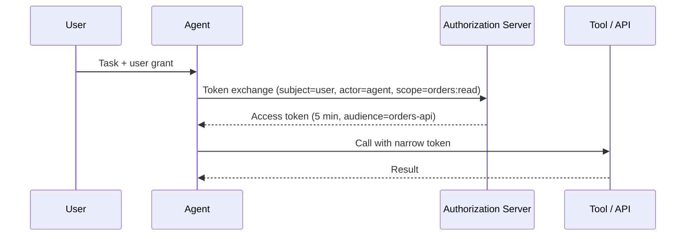

The fastest way to give an AI agent access to a system is to hand it an API key. It is also the worst way. The key usually outlives the task, carries more permission than the task needs, and makes every action look like it came from the same anonymous caller.

This post covers a better pattern: **delegated authorization**, where the agent receives a narrow, short-lived credential minted for one task, on behalf of one user.

## The Problem With Shared Credentials

When an agent authenticates with a static key or a user's own token, three things go wrong:

- **Over-permissioning.** The token grants everything the user or service account can do, not what this task requires.
- **Long lifetime.** If the token leaks through a log line, a prompt injection or a tool response, it stays valid for days or months.
- **No attribution.** Audit logs show "user X did this" even when an agent chose the action, so you cannot tell who decided.

Agents make each of these worse because they act autonomously, call many tools, and process untrusted content that may try to steer them.

## The Pattern: Exchange, Don't Share

Instead of passing the user's token along, the agent asks an authorization server to *exchange* it for a new token with a reduced scope. OAuth 2.0 already defines this in [RFC 8693 (Token Exchange)](https://www.rfc-editor.org/rfc/rfc8693), which has two concepts that map neatly onto agents:

- `subject_token`: the token representing the user the agent acts for.
- `actor_token`: a token identifying the agent itself.

The resulting access token can carry an `act` claim, recording that the agent is acting on behalf of the user. Downstream services can then authorize based on both identities.



## What A Request Looks Like

A token exchange request is a plain form-encoded POST:

```http
POST /oauth/token HTTP/1.1
Content-Type: application/x-www-form-urlencoded

grant_type=urn:ietf:params:oauth:grant-type:token-exchange
&subject_token=<user access token>
&subject_token_type=urn:ietf:params:oauth:token-type:access_token
&actor_token=<agent identity token>
&actor_token_type=urn:ietf:params:oauth:token-type:access_token
&scope=orders:read
&audience=https://orders.example.com
```

The server decides whether this agent may act for this user at this scope. If it agrees, it returns a token limited to that scope and audience.

## Four Design Rules

**1. Scope to the task, not the user.** Ask for the smallest scope that completes the step. An agent summarising orders needs `orders:read`, not `orders:*`.

**2. Bind the audience.** Use [resource indicators (RFC 8707)](https://www.rfc-editor.org/rfc/rfc8707) or the `audience` parameter so a token minted for one API is useless against another. A leaked token then has a small blast radius.

**3. Keep lifetimes short.** Minutes, not days. Let the agent re-exchange when it needs more. Short lifetimes turn a leak into a brief inconvenience rather than an incident.

**4. Sender-constrain where you can.** Techniques such as [DPoP (RFC 9449)](https://www.rfc-editor.org/rfc/rfc9449) tie a token to a key held by the caller, so a stolen token alone is not enough to use it.

## Keep Secrets Out Of The Model's Context

The model does not need to see the token. Put credential handling in your tool layer:

```python
def call_orders_api(ctx, path):
    token = ctx.auth.exchange(
        subject=ctx.user_token,
        actor=ctx.agent_identity,
        scope="orders:read",
        audience="https://orders.example.com",
        ttl_seconds=300,
    )
    return http.get(f"https://orders.example.com{path}",
                    headers={"Authorization": f"Bearer {token}"})
```

The model only chooses *which tool to call and with what arguments*. The runtime attaches credentials. If a tool result or a web page tries to trick the model into printing its token, there is nothing to print.

## Pair It With Human Approval For Risky Actions

Scoped tokens limit what an agent *can* do. Approval steps limit what it *does* without a person. For high-impact scopes such as `payments:write` or `users:delete`, have the token exchange require a fresh user confirmation, and keep the low-risk read scopes automatic. This is the same idea as the human-in-the-loop approval forms I've written about, enforced at the authorization layer instead of only in the UI.

## Make Delegation Auditable

Because every exchanged token records the user, the agent and the scope, your logs can answer the questions that matter after an incident:

- Which agent acted, and for whom?
- What scope was granted, and for how long?
- Which tool call used the token?

Log the exchange itself (who asked, what was granted or denied), not just the API call that followed.

## Takeaways

- Never give an agent a user's long-lived credential.
- Exchange for a token that is narrow in scope, bound to an audience and short in lifetime.
- Record both the user and the agent identity in the token so you can attribute every action.
- Handle credentials in the tool runtime, not the model context.
- Require explicit human confirmation for high-risk scopes.

None of this is new cryptography. It is standard OAuth applied with the assumption that the caller is autonomous and can be manipulated. That assumption is exactly the one to design for.
